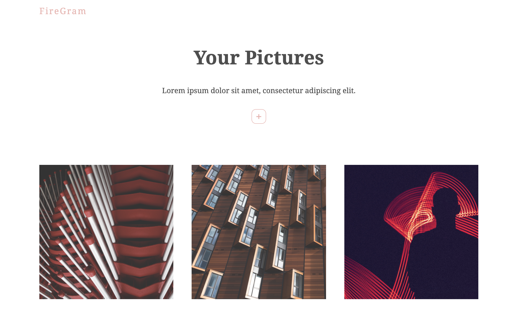

# Firegram

Web App where we can post our pictures which is linked to the Firebase for storing the images.

Concepts:

- Firebase(Firestore & Storage)
- React

## Screenshot

## Available Scripts

In the project directory, you can run:

### `npm start`

Runs the app in the development mode. 
Open [http://localhost:3000](http://localhost:3000) to view it in the browser.
